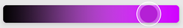

# `<BrightnessSlider />`

- ### A slider for adjusting the color brightness channel in the HSV color space.

## Props

### `adaptSpectrum`

- Slider background color spectrum adapts to changes in saturation and brightness.
- `type: boolean`
- `default: false`

import SliderProps from './_slidersProps.mdx';

<SliderProps />
