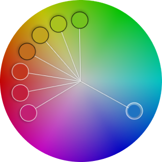

# `<ExtraThumb />`



Adds an extra thumb to the `Panel3` component.

:::info Note

- This component is used exclusively in the `Panel3` component.
- It serves as an indicator for the desired color and does not respond to any gestures.

:::

## Usage

```jsx
<Panel3 style={styles.panelStyle} renderCenterLine adaptSpectrum>
  <ExtraThumb thumbShape='circle' hueTransform={120} />
  <ExtraThumb thumbShape='circle' hueTransform={140} />
  <ExtraThumb thumbShape='circle' hueTransform={160} />
  {/* using colorTransform to transform the hue channel */}
  <ExtraThumb
    thumbShape='circle'
    colorTransform={color => {
      'worklet';
      return colorKit.runOnUI().spin(color, 180).hsv().object();
    }}
  />
  <ExtraThumb thumbShape='circle' hueTransform={200} />
  <ExtraThumb thumbShape='circle' hueTransform={220} />
  <ExtraThumb thumbShape='circle' hueTransform={240} />
</Panel3>
```

## Props

### `colorTransform`

- A Worklet function to transform or modify the color in the HSV (Hue, Saturation, Value) color space, taking an HSVA color object as input and returning a new HSVA color object. The returned object determines the thumb's position inside the panel.
- **Type:** `(color: HSVObject) => HSVObject`

### `hueTransform`

- An alternative to `colorTransform` for transforming the hue channel, where the transform amount can be a `number` or a `string`, allowing negative values. For example, it can be expressed as `'50%'` or `50`.
- **Type:** `string | number`

### `saturationTransform`

- An alternative to `colorTransform` for transforming the saturation channel, where the transform amount can be a `number` or a `string`, allowing negative values. For example, it can be expressed as `'50%'` or `50`.
- **Type:** `string | number`

### `brightnessTransform`

- An alternative to `colorTransform` for transforming the brightness channel, where the transform amount can be a `number` or a `string`, allowing negative values. For example, it can be expressed as `'50%'` or `50`.
- **Type:** `string | number`

### `onChange`

- Triggers every time the user modifies the color, allowing you to get the transformed color through a worklet function passed as a callback.
- The passed color object has the following properties: `hex`, `rgb`, `rgba`, `hsv`, `hsva`, `hwb`, `hwba`, `hsl`, and `hsla`
- **Type:** `(color: object) => void`
- **Default:** `undefined`

:::tip

- To prevent performance issues, it is best to avoid using `setState` in the `onChange` callback.
- It is highly recommended to utilize the `useSharedValue` function from the `react-native-reanimated` library.

:::

### `thumbSize`

- Thumb size (height\*width).
- **Type:** `number`
- **Default:** inherit from `Panel3`

### `thumbColor`

- Change thumb's color.
- **Type:** `string`
- **Default:** inherit from `Panel3`

### `thumbShape`

- Change thumb's shape and appearance.
- **Type:** `string`
- **Values:** `<shapes/>`
- **Default:** inherit from `Panel3`

### `thumbStyle`

- Thumb's containing View's style.
- **Type:** `ViewStyle`
- **Default:** inherit from `Panel3`

### `thumbInnerStyle`

- Thumb's inner View(s) style.
- **Type:** `ViewStyle`
- **Default:** inherit from `Panel3`

### `renderCenterLine`

- Controls whether to render a line from the center of the panel to the thumb (handle).
- **Type:** `boolean`
- **Default:** inherit from `Panel3`

import RenderThumb from './_renderThumb.mdx';

<RenderThumb />
