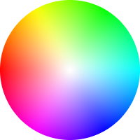
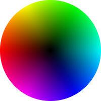

# `<Panel3 />`

|                **center channel: "saturation"**                |                **center channel: "brightness"**                |                  **center channel: "hsl-saturation"**                  |
| :------------------------------------------------------------: | :------------------------------------------------------------: | :--------------------------------------------------------------------: |
|  |  |  |

- The circle-shaped slider, with its wheel style design, is utilized to adjust the hue and (saturation or brightness) of colors.

- Move thumb (handle) around the center to change the color's hue.

- Move thumb (handle) away or toward the center to change the saturation or the brightness of the color, depending on the `verticalChannel` prop..

:::tip

If you want to give your users more control over the color selection, you can add another slider next to this one that adjusts the opposite channel. For example, if `centerChannel` is `"saturation"`, you can add a [`<BrightnessSlider />`](../Sliders/HSB/BrightnessSlider) slider, and vice versa.

:::

## Props

### `centerChannel`

- Determines which color channel to adjust when moving the thumb towards or away from the center of the circular slider.
- `type: "saturation" | "brightness" | "hsl-saturation"`
- `default: "saturation"`

### `rotate`

- Specify a degree of rotation for the hue circle
- `type: number`
- `default: 0`

### `renderCenterLine`

- Controls whether to render a line from the center of the panel to the thumb (handle).
- `type: boolean`
- `default: false`

### `boundedThumb`

- Determines whether the panel slider thumb (or handle) should be constrained to stay within the boundaries of the panel.
- When set to `true`, the thumb will not be allowed to move beyond the edges of the panel.
- When set to `false`, part of it will be outside of the panel bounds.
- `type: boolean`
- `default: false`

### `thumbSize`

- Panel's handle (thumb) size (height\*width).
- `type: number`
- `default: 35`

### `thumbColor`

- Change thumb's color.
- `type: string`
- `default`: interactive\*

:::info **\*interactive**

- The thumb color will be changed depending on the contrast ratio if no color value is passed.

:::

### `thumbShape`

- Change thumb's shape and appearance.
- `type: string`
- `values`: <Shapes/>
- `default: 'ring'`

### `thumbStyle`

- Thumb's containing View's style.
- `type: ViewStyle`

### `thumbInnerStyle`

- Thumb's inner View(s) style.
- `type: ViewStyle`

### `thumbScaleAnimationValue`

- Controls the scale value animation of the thumb when active.
- `type: number`
- `default: 1.2`

### `thumbScaleAnimationDuration`

- Sets the duration of the scale animation of the thumb when active.
- `type: number`
- `default: 100`

import RenderThumb from '../_renderThumb.mdx';

<RenderThumb />

### `gestures`

- An array of gestures or composed gestures from `react-native-gesture-handler`.
- These gestures will run simultaneously with the color picker gestures.
- `type: Gesture[]`
- `default: []`

### `adaptSpectrum`

- Slider background color spectrum adapts to changes in saturation and brightness.
- `type: boolean`
- `default: false`

### `style`

- Panel's container style.
- `type: ViewStyle`

:::info note

- Certain style properties will be overridden.

:::
