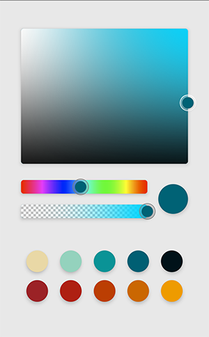
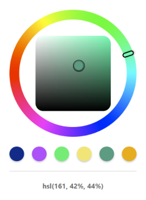
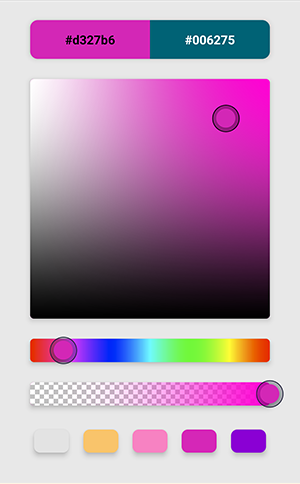
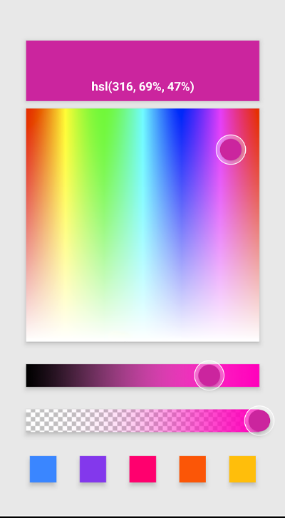
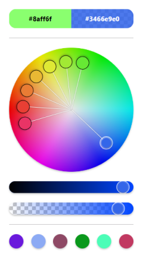
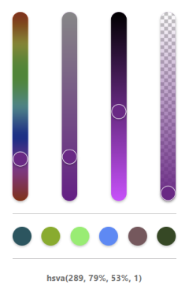
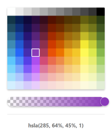

# Reanimated Color Picker

#### - A Pure JavaScript Color Picker for React Native.

#### - Highly customizable.

#### - Supports IOS, Android, Expo, and Web platforms.

#### - Supports right-to-left (RTL) layouts.

 

 

 

 

 

# Table of contents

### 1. [Installation](./Installation)

### 2. [Usage](./Usage)

### 3. [API](./category/api)

- [ColorPicker Wrapper](./API/ColorPicker)

- [**Panels**](./category/Panels)

  - [Panel1](./API/Panels/Panel1)
  - [Panel2](./API/Panels/Panel2)
  - [Panel3](./API/Panels/Panel3)
  - [Panel4](./API/Panels/Panel4)
  - [Panel5](./API/Panels/Panel5)

- [**Sliders**](./category/Sliders)

  - [**Hue**](./category/Hue)

    - [HueSlider](./API/Sliders/Hue/HueSlider)
    - [HueCircular](./API/Sliders/Hue/HueCircular)

  - [**HSB**](./category/HSB)

    - [BrightnessSlider](./API/Sliders/HSB/BrightnessSlider)
    - [SaturationSlider](./API/Sliders/HSB/SaturationSlider)

  - [**HSL**](./category/HSL)

    - [LuminanceSlider](./API/Sliders/HSL/LuminanceSlider)
    - [HSLSaturationSlider](./API/Sliders/HSL/HSLSaturationSlider)

  - [**HSL**](./category/RGB)

    - [RedSlider](./API/Sliders/RGB/RedSlider)
    - [GreenSlider](./API/Sliders/RGB/GreenSlider)
    - [BlueSlider](./API/Sliders/RGB/BlueSlider)

  - [OpacitySlider](./API/Sliders/OpacitySlider)

  - [**Preview**](./category/Preview)

    - [Preview](./API/Preview)
    - [PreviewText](./API/Preview/PreviewText)
    - [InputWidget](./API/Preview/InputWidget)
    - [Swatches](./API/Preview/Swatches)
    - [ExtraThumb](./API/Preview/ExtraThumb)

### 4. [ColorKit](./ColorKit)

### 5. [Examples](./Examples)
