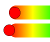

# ColorPicker Wrapper

- The `ColorPicker` Wrapper is responsible for managing the built-in components.

:::caution

All built-in components should be wrapped within the `ColorPicker` component.

:::

- You can nest components within the `ColorPicker` wrapper to achieve the desired level of customization.

```jsx
<ColorPicker>
  <Preview />

  <View>
    <Panel1 />
    <HueSlider vertical />
  </View>

  <View>
    <Text>Opacity</Text>
    <OpacitySlider />
  </View>

  <Swatches />
</ColorPicker>
```

## Props

### `value`

- The initial color that should be displayed when the `ColorPicker` is loaded.
- If the `value` property is modified, the `ColorPicker` will automatically update the displayed color.
- Accepts: `'hex' | 'rgb' | 'rgba' | 'hsl' | 'hsla' | 'hsv' | 'hsva' | 'hwb' | 'hwba' | named colors` formats.
- `type: string`
- `default: '#418181'`

### `adaptSpectrum`

- A global property that allows the slider background color spectrum to adapt to changes in brightness and saturation for all descendant slider components.
- `type: boolean`
- `default: false`

### `boundedThumb`



- A global property for all descendant sliders and panels components.
- Determines whether the slider thumb (or handle) should be constrained to stay within the boundaries of the slider.
- When set to `true`, the thumb will not be allowed to move beyond the edges of the slider.
- When set to `false`, part of it will be outside of the slider bounds.
- `type: boolean`
- `default: false`

### `sliderThickness`

- A global property that allows for changing the thickness of all descendant slider components.
- The thickness refers to the `width` of the slider in the case of a `vertical` orientation, and the `height` in the case of a `horizontal` orientation.
- `type: number`
- `default: 25`

### `thumbAnimationDuration`

- A global property to change the duration which the thumbs animate when the value prop changes.
- `type: number`
- `default: 200`

### `thumbSize`

- A global property for changing the thumb size of all descendant slider components.
- `type: number`
- `default: 35`

### `thumbColor`

- A global property for changing the thumb color of all descendant slider components.
- `type: string`
- `default: undefined`

### `thumbShape`

- A global property that allows for the alteration of the thumb shape and appearance of all descendant slider components.
- `type: string`
- `default: 'ring'`
- `values:`<shapes/>

### `thumbStyle`

- A global property to change the style of the thumb's View for all descendant sliders components.
- `type: ViewStyle`

### `thumbInnerStyle`

- A global property to change the color of the thumb's inner View(s) for all descendant sliders components.
- `type: ViewStyle`

import RenderThumb from './_renderThumb.mdx';

<RenderThumb />

### `style`

- The container style of the `ColorPicker`.
- `type: ViewStyle`

:::info note

- Certain style properties will be overridden.

:::

### `onChange`

- Triggers every time the user modifies the color.
- The passed color object has the following properties: `hex`, `rgb`, `rgba`, `hsv`, `hsva`, `hwb`, `hwba`, `hsl`, and `hsla`
- `type: (color: object) => void`
- `default: null`

:::tip

- To prevent performance issues, it is best to avoid using `setState` in the `onChange` callback.
- It is highly recommended to utilize the `useSharedValue` function from the `react-native-reanimated` library.

:::

### `onComplete`

- Triggered upon the user releasing the slider handle or clicking on a swatch.
- The passed color object has the following properties: `hex`, `rgb`, `rgba`, `hsv`, `hsva`, `hwb`, `hwba`, `hsl`, and `hsla`
- `type: (color: object) => void`
- `default: null`

## Methods

### `setColor`

- Set the currently displayed color in the color picker to a new one. Note that this won’t trigger any events like `onChange` and `onComplete`.
- This is useful if you want to update the displayed color without binding a state to the color picker `value` property.

```tsx
import ColorPicker from 'reanimated-color-picker';
import type { ColorPickerRef } from 'reanimated-color-picker';

function MyComponent() {
  const pickerRef = useRef<ColorPickerRef>(null);

  const setNewColorHandle = () => {
    if (pickerRef.current) {
      pickerRef.current.setColor('orange');
    }
  };

  return <ColorPicker ref={pickerRef}>{/* the rest of your code */}</ColorPicker>;
}
```
