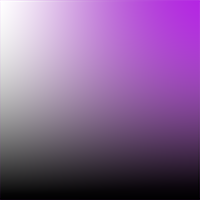

# `<Panel1 />`



- A square-shaped slider, reminiscent of Adobe style, is utilized to adjust the brightness and saturation of colors..

- Move the handle horizontally to change the color's saturation.

- Move the handle vertically to change the color's brightness.

:::tip

- Add [`<HueSlider />`](./HueSlider) component also to gain control over the three color channels.

:::

## Props

### `thumbSize`

- Panel's handle (thumb) size (height\*width).
- `type: number`
- `default: 35`

### `thumbColor`

- Change thumb's color.
- `type: string`
- `default`: interactive\*

:::info **\*interactive**

- The color of the thumb will be adjusted according to the contrast ratio, in the absence of a specific color value.

:::

### `thumbShape`

- Change thumb's shape and appearance.
- `type: string`
- `values`: <shapes/>
- `default: 'ring'`

### `thumbStyle`

- Thumb's containing View's style.
- `type: ViewStyle`

### `thumbInnerStyle`

- Thumb's inner View(s) style.
- `type: ViewStyle`

### `renderThumb`

- Function which receives `ThumbProps` and returns a custom thumb component.
- Overrides `thumbShape`
- `type: (props: ThumbProps) => ReactElement`
- Example Usage:

```jsx
renderThumb={({ handleStyle, width, height }) => (
    <Animated.View
      style={[
        StyleSheet.absoluteFillObject,
        handleStyle,
        { backgroundColor: 'red', width, height },
      ]}
    />
  )}
```

### `style`

- Panel's container style.
- `type: ViewStyle`

:::info note

- Certain style properties will be overridden.

:::
