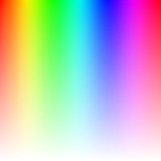

# `<Panel2 />`

 < or > 

- A square-shaped slider (windows style) is utilized to adjust the hue and (saturation or brightness) channels.

- Move the thumb (handle) horizontally to change the color's hue.

- Drag the thumb (handle) up or down to adjust either the saturation or the brightness of the color, depending on the `verticalChannel` prop.

:::tip

If you want to give your users more control over the color selection, you can add another slider next to `Panel2` that adjusts the opposite channel. For example, if `verticalChannel` is `"saturation"`, you can add a [`<BrightnessSlider />`](./BrightnessSlider), and vice versa.

:::

## Props

### `verticalChannel`

- Determines which color channel to adjust when moving the thumb vertically on the slider.
- `type: "saturation" | "brightness"`
- `default: "saturation"`

### `boundedThumb`

- Determines whether the panel slider thumb (or handle) should be constrained to stay within the boundaries of the panel.
- When set to `true`, the thumb will not be allowed to move beyond the edges of the panel.
- When set to `false`, part of it will be outside of the panel bounds.
- `type: boolean`
- `default: false`

### `thumbSize`

- Panel's handle (thumb) size (height\*width).
- `type: number`
- `default: 35`

### `thumbColor`

- Change thumb's color.
- `type: string`
- `default`: interactive\*

:::info **\*interactive**

- The thumb color will be changed depending on the contrast ratio if no color value is passed.

:::

### `thumbShape`

- Change thumb's shape and appearance.
- `type: string`
- `values`: <shapes/>
- `default: 'ring'`

### `thumbStyle`

- Thumb's containing View's style.
- `type: ViewStyle`

### `thumbInnerStyle`

- Thumb's inner View(s) style.
- `type: ViewStyle`

### `renderThumb`

- Function which receives `ThumbProps` and returns a custom thumb component.
- Overrides `thumbShape`

#### `ThumbProps`

|      Prop       |         Type          | Description                                                                                       |
| :-------------: | :-------------------: | :------------------------------------------------------------------------------------------------ |
| `positionStyle` |      `StyleProp`      | This style determines the position of the thumb and is a crucial element that should be included. |
|     `width`     |       `number`        | Extracted from the `thumbSize` prop and it's important for thumb position calculation.            |
|    `height`     |       `number`        | Extracted from the `thumbSize` prop and it's important for thumb position calculation.            |
| `adaptiveColor` | `SharedValue<string>` | White or black based on the contrast ratio.                                                       |
| `currentColor`  | `SharedValue<string>` | This shared value will update whenever the color changes.                                         |
| `initialColor`  |       `string`        | The initial color value as a `string`.                                                            |

- Example Usage:

```jsx
import Animated, { useAnimatedStyle } from 'react-native-reanimated';
import type { RenderThumbProps } from 'reanimated-color-picker';

function MyCustomThumb({
  width,
  height,
  positionStyle,
  adaptiveColor,
  currentColor,
  initialColor,
}: RenderThumbProps) {

  const animatedStyle = useAnimatedStyle(() => ({
    borderColor: adaptiveColor.value,
    backgroundColor: currentColor.value,
  }));

  return (
    <Animated.View
      style={[
        { width, height, borderWidth: 1, borderRadius: width / 2, overflow: 'hidden' },
        animatedStyle,
        positionStyle,
        ]}
    >
      <View style={{ backgroundColor: initialColor, width: '50%', height, alignSelf: 'flex-end' }} />
    </Animated.View>
  );
}
```

### `adaptSpectrum`

- Slider background color spectrum adapts to changes in saturation and brightness.
- `type: boolean`
- `default: false`

### `reverse`

- Reverse (flip) hue direction.
- `type: boolean`
- `default: false`

### `style`

- Panel's container style.
- `type: ViewStyle`

:::info note

- Certain style properties will be overridden.

:::
