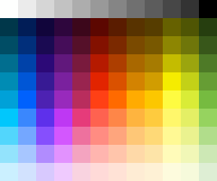

# `<Panel5 />`

- This is a grid of 120 colors, arranged in 12 columns and 10 rows of squares.

:::danger

This panel is limited to displaying only a fixed range of colors, and therefore cannot show all colors.

:::

## Props

### `style`

- Panel's container style.
- `type: ViewStyle`

:::info note

- Certain style properties will be overridden.

:::
