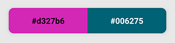

# `<Preview />`

- The preview of the selected and the initial color.

:::tip

- If you want only the preview text, you can use the [`<PreviewText />`](./PreviewText) component.

:::

## Props

### `colorFormat`

- Preview color's format.
- `type: string`
- `values:`<formats/>
- `default: 'hex'`

### `hideInitialColor`

- Hide the initial color preview part.
- `type: boolean`
- `default: false`

### `hideText`

- Hide preview texts.
- `type: boolean`
- `default: false`

### `style`

- Preview container style.
- `type: ViewStyle`

:::info note

- Certain style properties will be overridden.

:::

### `textStyle`

- Preview texts style.
- `type: TextStyle`
